# UML — Sales.AI (CodeOn POS)

> Stack: Vue 3 + TypeScript + Pinia + Vue Router + Axios + Socket.io + Tailwind CSS v4

---

## 1. Kiến trúc tổng thể (System Architecture)

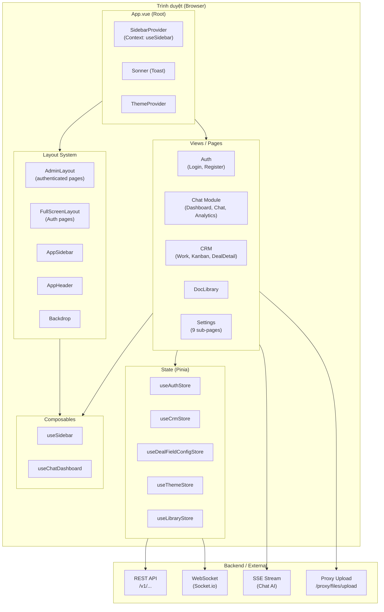

---

## 2. Cây component (Component Tree)

```mermaid
graph TD
    AppVue["App.vue"]
    AppVue --> ThemeProvider
    AppVue --> SidebarProvider
    AppVue --> Sonner
    AppVue --> RouterView

    RouterView --> AdminLayout
    RouterView --> FullScreenLayout

    AdminLayout --> AppSidebar
    AdminLayout --> AppHeader
    AdminLayout --> Backdrop
    AdminLayout --> PageSlot["&lt;slot&gt; (page content)"]

    AppHeader --> BrandLogo
    AppHeader --> ThemeToggler
    AppHeader --> UserMenu["User Menu"]
    AppHeader --> NotifMenu["Notification Menu"]

    FullScreenLayout --> AuthPages["LoginView\nRegisterView"]

    PageSlot --> CrmWorkView
    PageSlot --> CrmDealsKanbanView
    PageSlot --> CrmDealDetailView
    PageSlot --> CrmDuplicateCheckView
    PageSlot --> ChatModuleView
    PageSlot --> DocLibraryView
    PageSlot --> SettingsView

    CrmDealsKanbanView --> DealFieldConfigModal
    CrmDealsKanbanView --> EmailConflictDialog
    DocLibraryView --> LibraryTree
    LibraryTree --> LibraryTree

    ChatModuleView --> ChatDashboardView
    ChatModuleView --> ChatView
    ChatModuleView --> ChatAnalyticsView

    SettingsView --> AppearanceSettings
    SettingsView --> ProfileSettings
    SettingsView --> NotificationSettings
    SettingsView --> LanguageSettings
    SettingsView --> SecuritySettings
    SettingsView --> ApiIntegrationSettings
    SettingsView --> WebhookLogsView
    SettingsView --> PermissionGroupsSettings
    SettingsView --> DocumentPermissionsView
```

---

## 3. Sơ đồ lớp — Pinia Stores (Class Diagram)

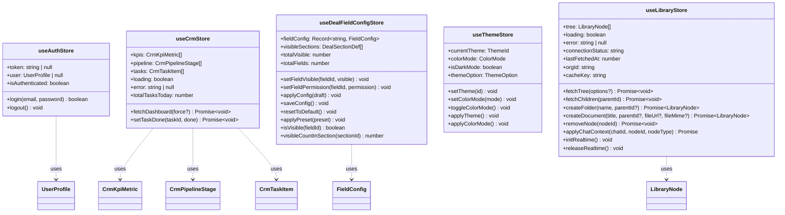

---

## 4. Sơ đồ lớp — Types & Interfaces

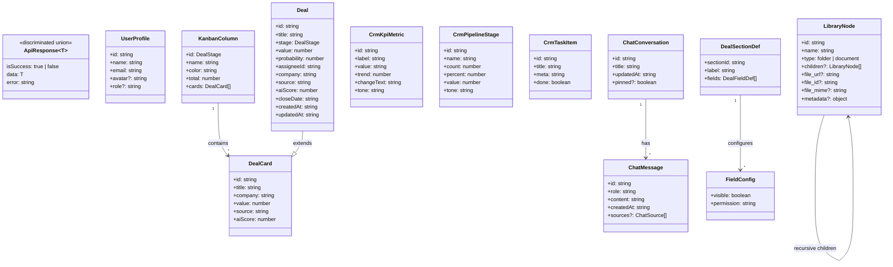

---

## 5. Sơ đồ lớp — API Services

```mermaid
classDiagram
    class ApiService {
        <<module api.ts>>
        +axiosInstance: AxiosInstance
        +get~T~(url, params?) Promise~ApiResponse~T~~
        +post~T~(url, body?) Promise~ApiResponse~T~~
        +put~T~(url, body?) Promise~ApiResponse~T~~
        +patch~T~(url, body?) Promise~ApiResponse~T~~
        +del~T~(url) Promise~ApiResponse~T~~
    }

    class CrmService {
        <<module crm.ts>>
        +getCrmDashboard() Promise~ApiResponse~CrmDashboardPayload~~
        +updateCrmTaskStatus(taskId, done) Promise
        +getCrmDealsKanban() Promise
        +createCrmDeal(payload) Promise
    }

    class DealsService {
        <<module deals.ts>>
        +listDealsKanban() Promise~ApiResponse~DealsKanbanPayload~~
        +createDeal(input) Promise~ApiResponse~Deal~~
        +getDealById(dealId) Promise~ApiResponse~Deal~~
        +updateDeal(dealId, patch) Promise~ApiResponse~Deal~~
        +updateDealStage(dealId, stage) Promise~ApiResponse~Deal~~
        +deleteDeal(dealId) Promise~ApiResponse~void~~
        -VITE_DEALS_USE_MOCK: boolean
    }

    class ChatService {
        <<module chat.ts>>
        +fetchChatConversations() Promise
        +getDashboardStats() Promise
        +getRecentSessions(limit?) Promise
        +getAiSuggestions() Promise
        +getPopularQuestions(limit?) Promise
        +pinSession(sessionId) Promise
        +deleteSession(sessionId) Promise
        +fetchConversationMessages(conversationId) Promise
        +sendChatMessage(payload) Promise
        +streamChatMessage(payload, handlers, signal?) Promise~void~
        +pickAssistantText(data) string | null
    }

    class LibraryService {
        <<module library.ts>>
        +fetchLibraryTree(params?) Promise
        +getRecentDocuments(limit?) Promise
        +createLibraryFolder(payload) Promise~ApiResponse~LibraryNode~~
        +createLibraryDocument(payload) Promise~ApiResponse~LibraryNode~~
        +deleteLibraryNode(nodeId) Promise
        +setChatContext(chatId, payload) Promise
        +uploadFileExternal(file, onProgress?) Promise
    }

    class ProfileService {
        <<module profile.ts>>
        +getProfile() Promise~ApiResponse~UserProfile~~
        +updateProfile(payload) Promise~ApiResponse~UserProfile~~
        +changeAvatar(file) Promise
    }

    class SecurityService {
        <<module security.ts>>
        +changePassword(payload) Promise
        +getActiveSessions() Promise
        +revokeSession(sessionId) Promise
    }

    ApiService <|-- CrmService : uses
    ApiService <|-- DealsService : uses
    ApiService <|-- ChatService : uses
    ApiService <|-- LibraryService : uses
    ApiService <|-- ProfileService : uses
    ApiService <|-- SecurityService : uses
```

---

## 6. Bản đồ Routes (Navigation Map)

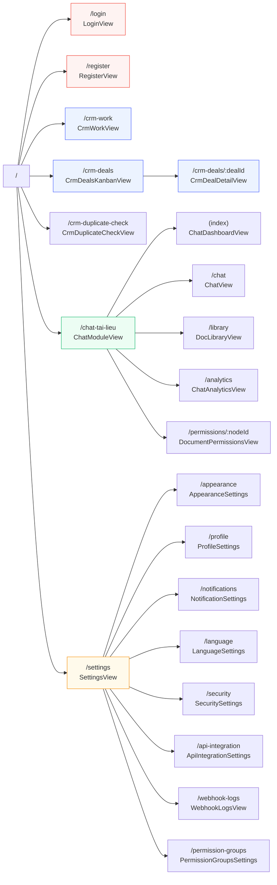

---

## 7. Sequence Diagram — Đăng nhập (Login Flow)

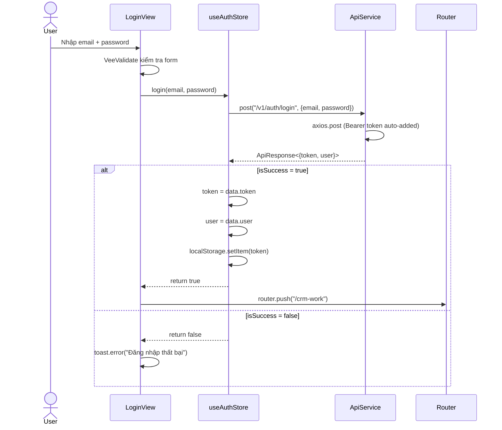

---

## 8. Sequence Diagram — CRM Kanban (Deal Move Flow)

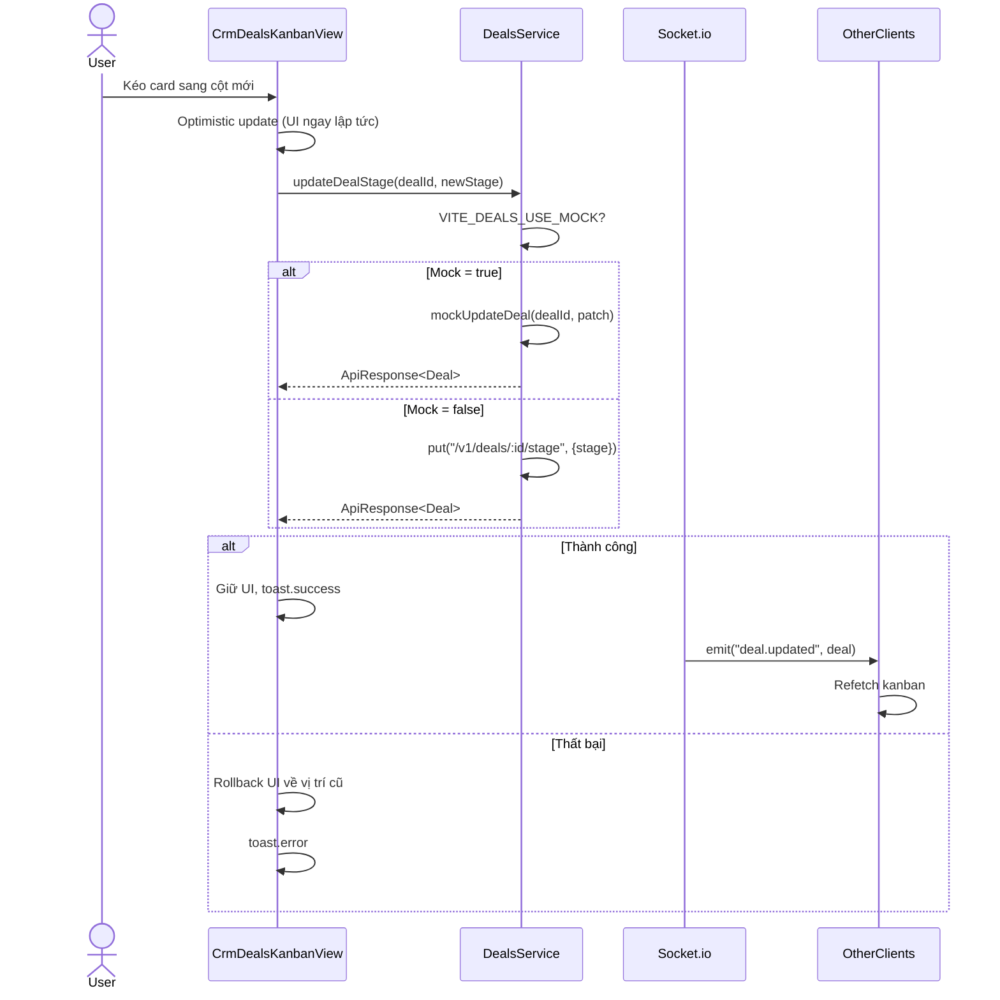

---

## 9. Sequence Diagram — Chat AI (Streaming Flow)

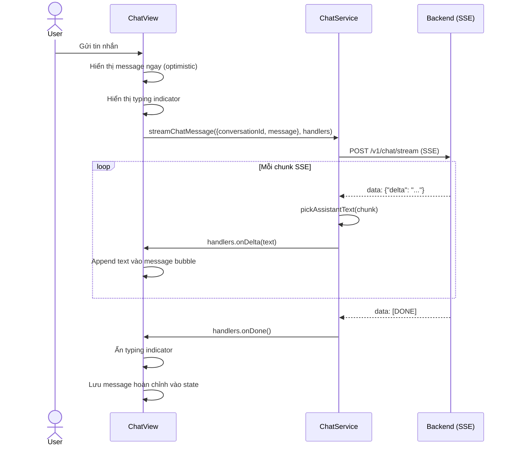

---

## 10. Sequence Diagram — Document Library (Real-time Sync)

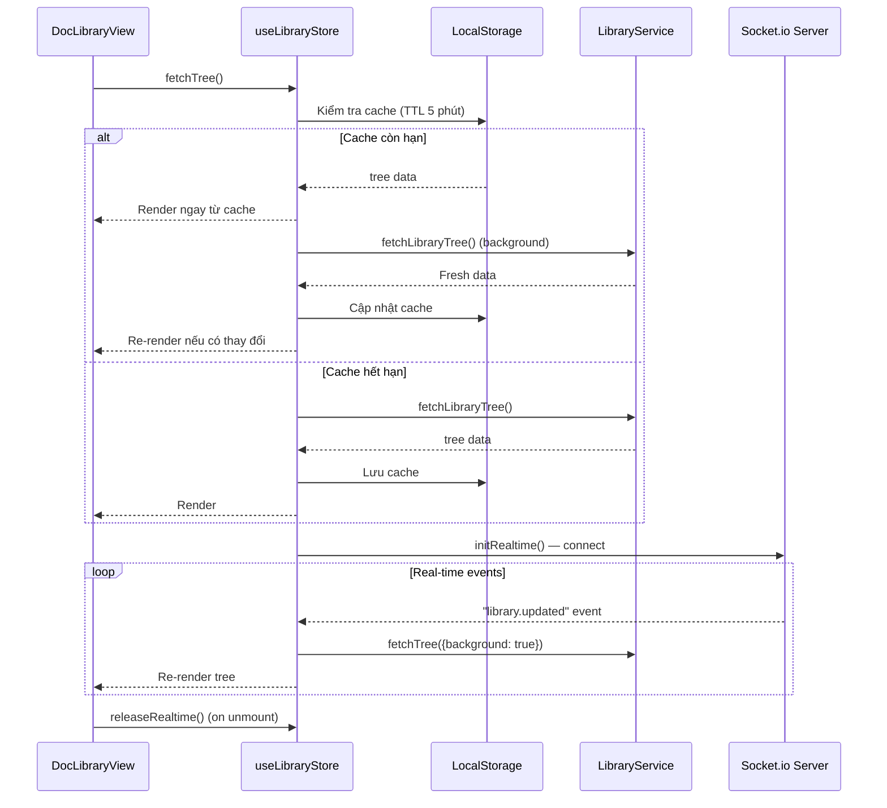

---

## 11. Sequence Diagram — Upload File (Library)

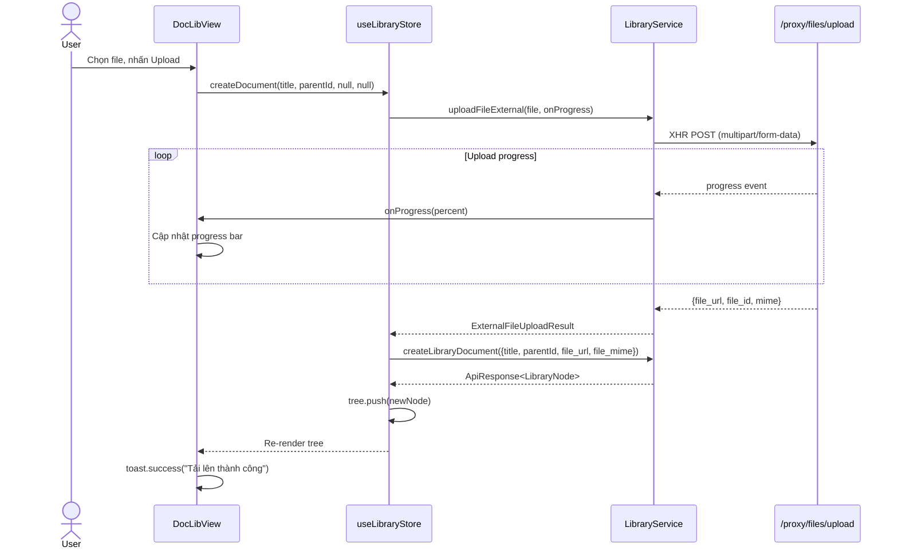

---

## 12. Sơ đồ luồng dữ liệu (Data Flow Diagram)

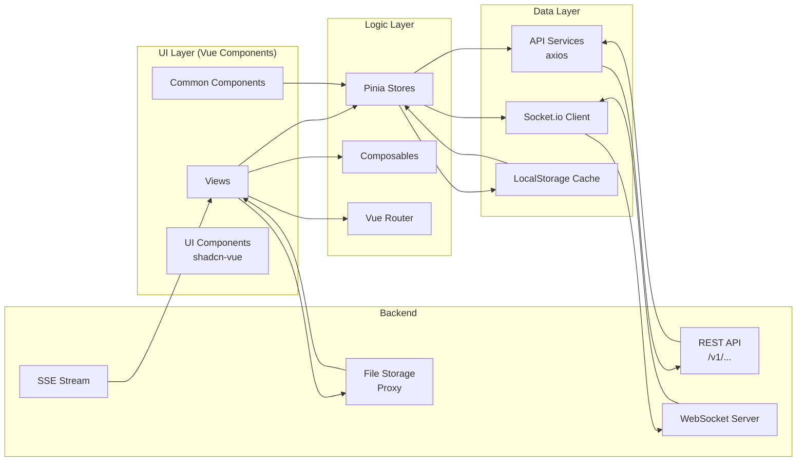

---

## 13. Sơ đồ Sidebar & Theme System

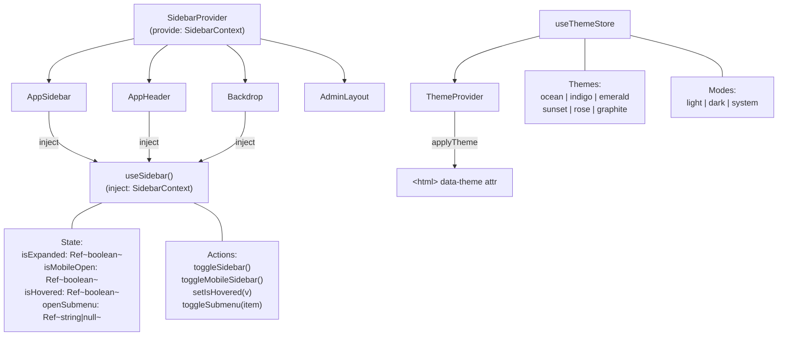

---

## 14. Deal Field Config System (158 fields)

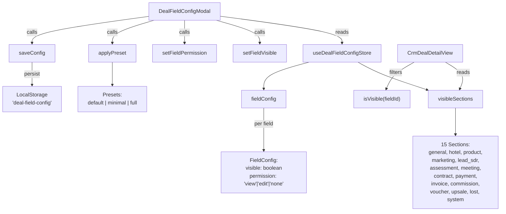

---

## 15. Tóm tắt mối quan hệ module

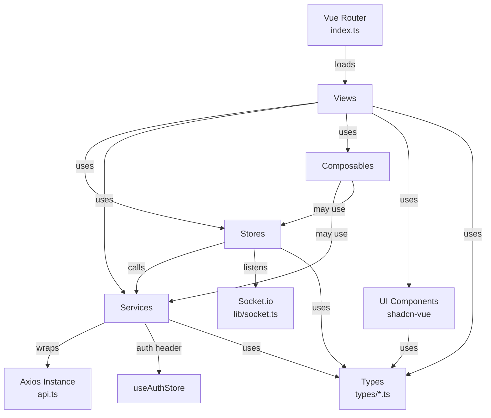
